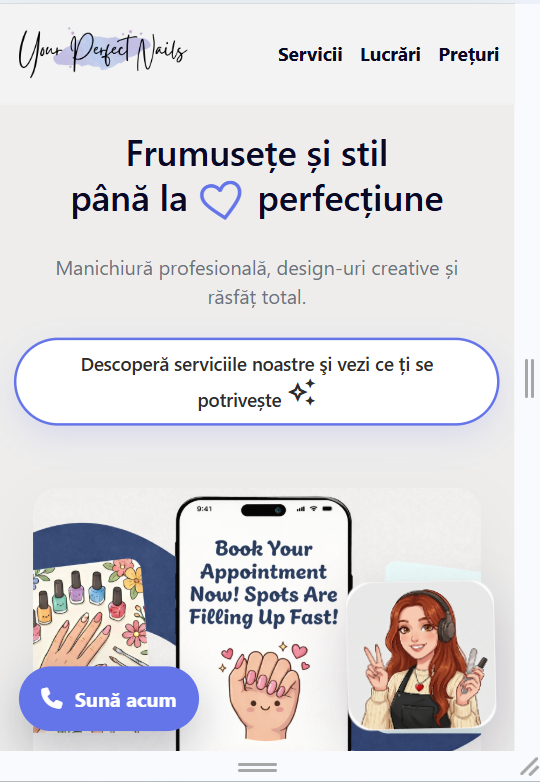
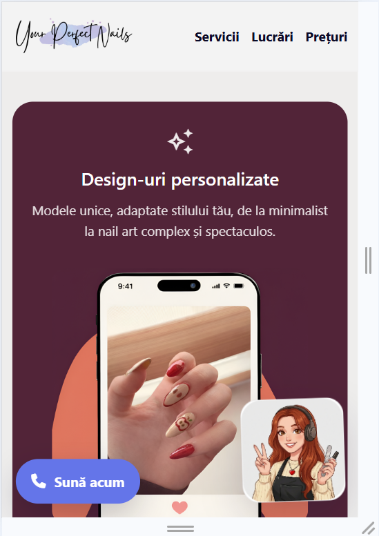
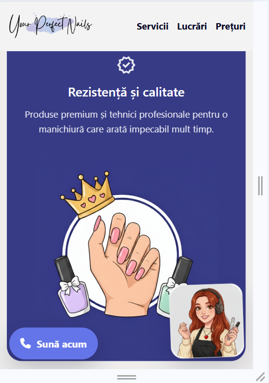
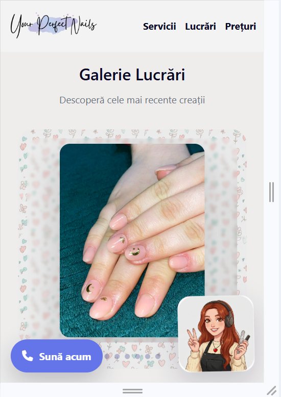
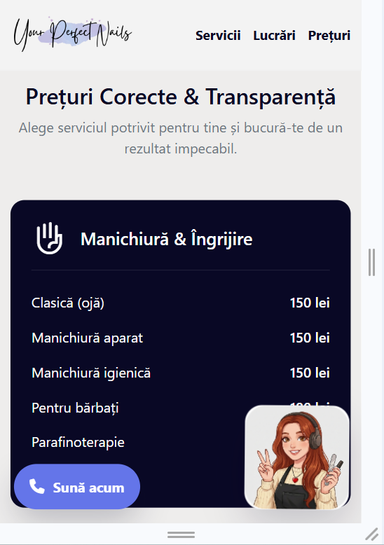
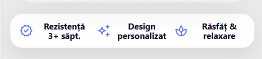
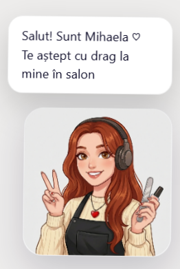

# Nail Studio Landing Page

## Project Description

This project is a modern landing page for a Nail Studio business.  
The goal of the page is to present the services in a clear and attractive way and encourage visitors to book an appointment.

The landing page includes a hero section with a strong headline, service highlights, a portfolio gallery, and a pricing section. It also contains clear call-to-action buttons that guide users to make a reservation. The design focuses on beauty, simplicity, and a pleasant user experience.

The website is built using HTML and CSS. It follows landing page best practices such as structured sections, visual hierarchy, and easy navigation between sections.

---

## Sections Included

The landing page contains the following sections:

- Hero section with headline and call-to-action
- Services / Features section
- Portfolio gallery section
- Pricing section
- Footer with contact information

The navigation menu allows users to quickly scroll to each section.

---

## Screenshots

### Hero Section
<!-- Add screenshot here -->

### Services Section
<!-- Add screenshot here -->

### Portfolio Section
<!-- Add screenshot here -->

### Pricing Section
<!-- Add screenshot here -->

---

### Responsive Design (Mobile Support)
To support clients who view the landing page on mobile devices, the layout was made responsive using media queries and flexible sizing. For smaller screens, typography and spacing were adjusted so the content remains readable and well aligned. The hero section title and the main CTA button were resized on mobile, and the CTA text styling was improved (smaller text and no underline) to look cleaner on phones.

### Call to Action Visible on Mobile
A mobile-only floating call-to-action button (“Sună acum”) was added using a fixed position element. This ensures an important CTA stays visible even when the user scrolls. The button uses a Font Awesome phone icon and is displayed only on small screens, while the desktop navbar CTA remains separate.

### Mobile-only Element
A dedicated section visible only on mobile was added to satisfy the “mobile-only elements” requirement. This section is hidden on desktop and becomes visible only under the mobile breakpoint, so mobile visitors see extra content that does not appear on larger screens.

---

### Mascot Requirements (Clippy-style)
A friendly nail-studio mascot was added in the corner of the page. It matches the landing page topic and is designed to look pleasant and approachable.

The mascot appears **after a short delay** when the page loads (fade + slide animation), so it feels interactive rather than distracting instantly. It also includes **continuous animation** (floating effect) and a simple frame swap effect to make it look alive.

When the user **hovers** over the mascot on desktop, it displays a small speech bubble with a welcome message (example: “Salut! Sunt Mihaela. Te aștept cu drag la mine în salon”), satisfying the hover message requirement.

---

## Live Demo

You can view the live version of the project here:

[View Live Demo](http://yourperfectnails.site/)

---

## Technologies Used

- HTML5
- CSS3

---

## Author

Created as a landing page project for a Nail Studio business.
