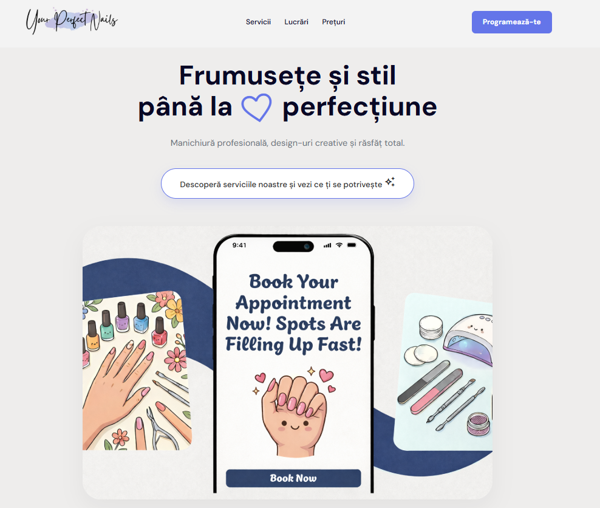
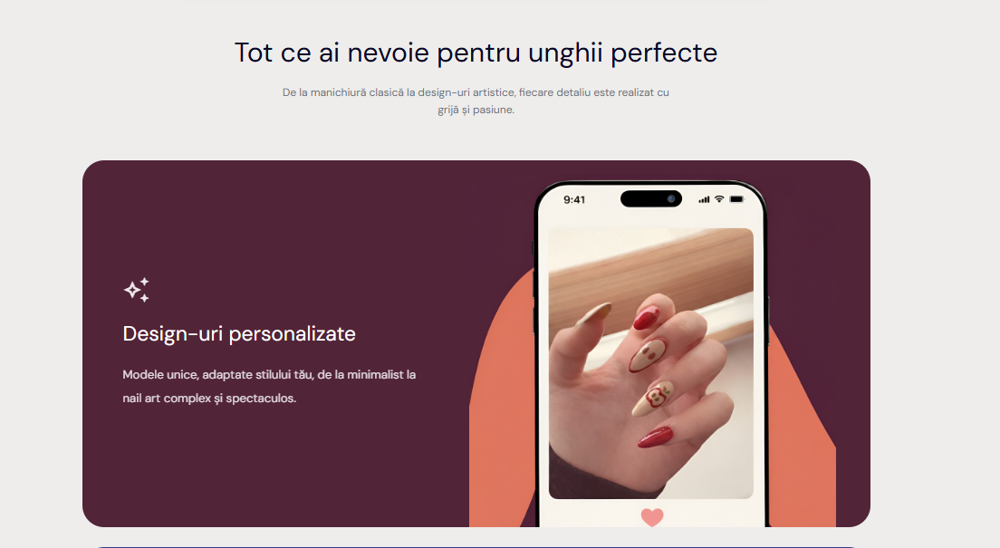
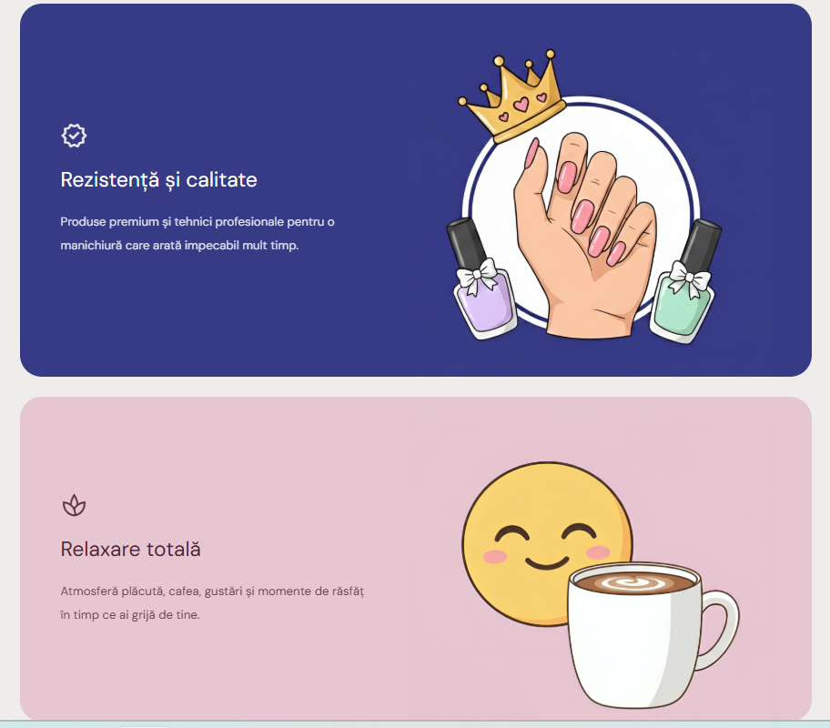
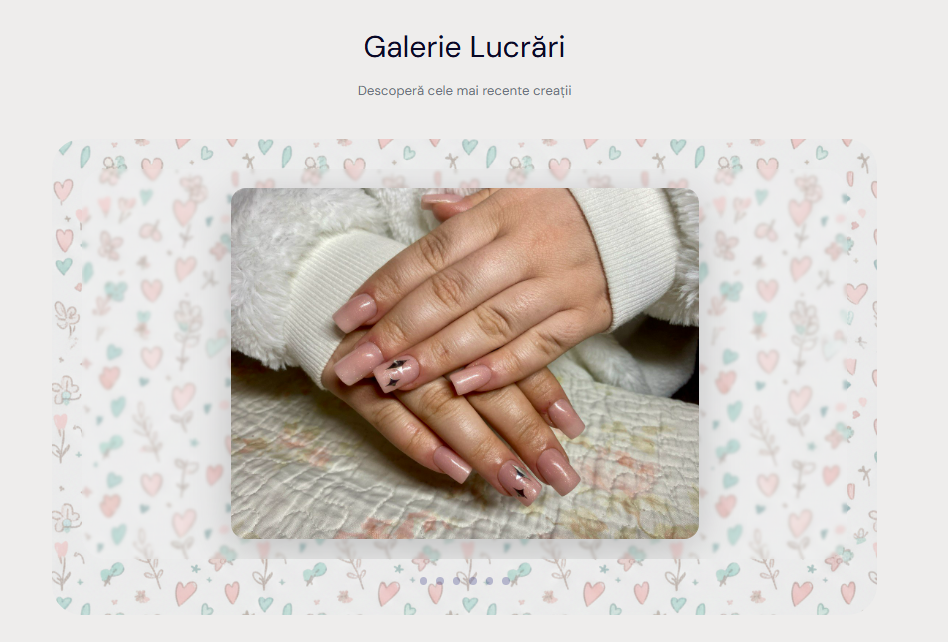
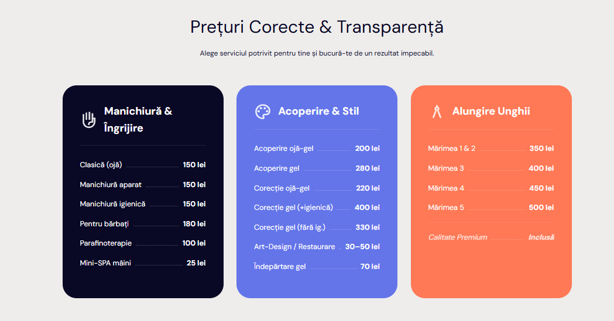

# Nail Studio Landing Page

## Project Description

This project is a modern landing page for a Nail Studio business.  
The goal of the page is to present the services in a clear and attractive way and encourage visitors to book an appointment.

The landing page includes a hero section with a strong headline, service highlights, a portfolio gallery, and a pricing section. It also contains clear call-to-action buttons that guide users to make a reservation. The design focuses on beauty, simplicity, and a pleasant user experience.

The website is built using HTML and CSS. It follows landing page best practices such as structured sections, visual hierarchy, and easy navigation between sections.

---

## Sections Included

The landing page contains the following sections:

- Hero section with headline and call-to-action
- Services / Features section
- Portfolio gallery section
- Pricing section
- Footer with contact information

The navigation menu allows users to quickly scroll to each section.

---

## Screenshots

### Hero Section
<!-- Add screenshot here -->

### Services Section
<!-- Add screenshot here -->

### Portfolio Section
<!-- Add screenshot here -->

### Pricing Section
<!-- Add screenshot here -->

---

## Live Demo

You can view the live version of the project here:

[View Live Demo](https://mariaelenabotnari.github.io/tum-web-lab-2/)

---

## Technologies Used

- HTML5
- CSS3

---

## Author

Created as a landing page project for a Nail Studio business.
